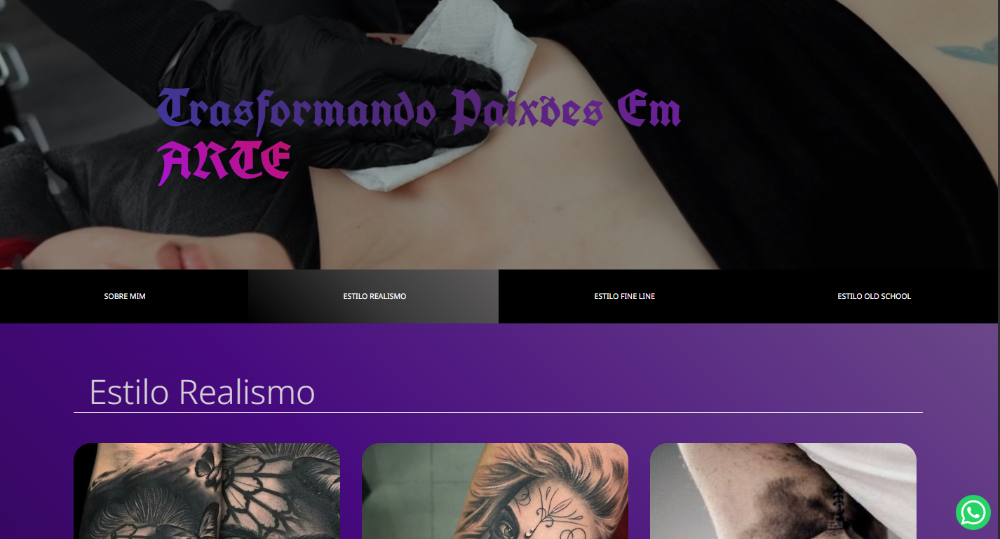
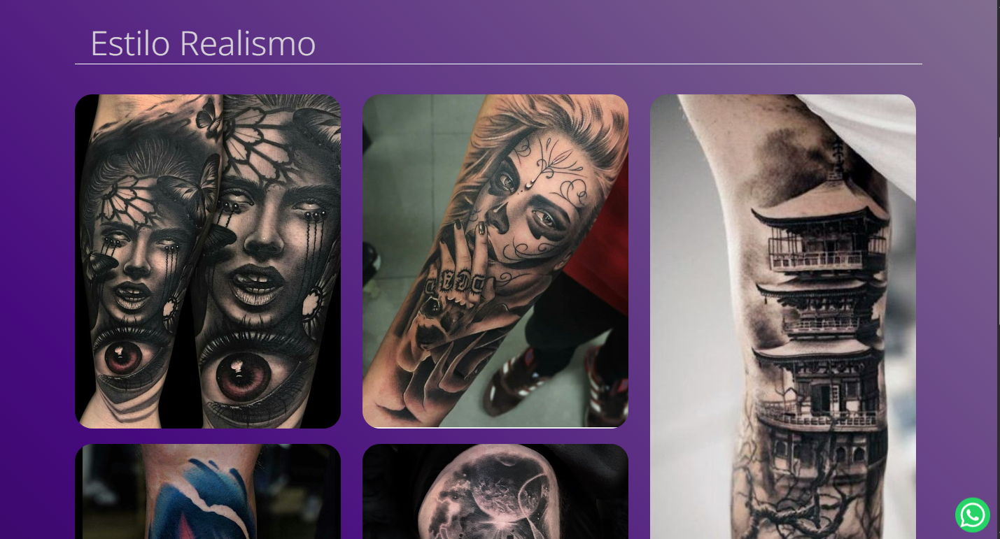
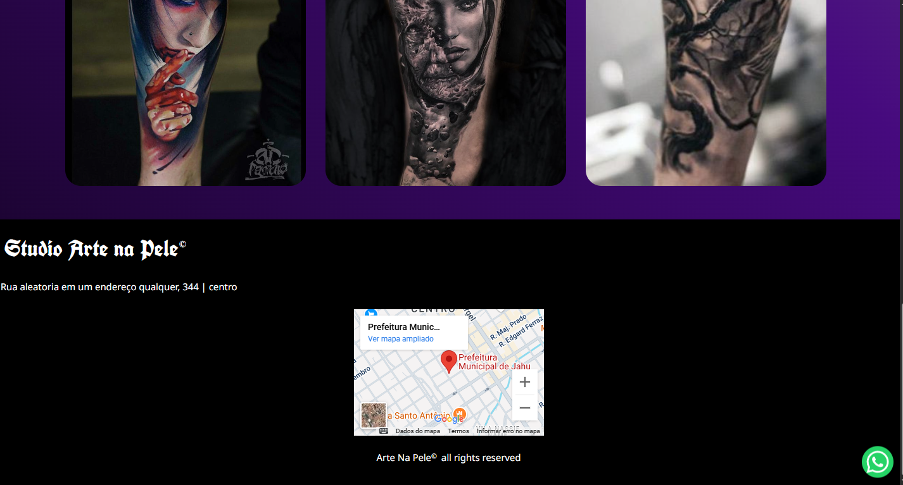
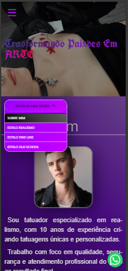
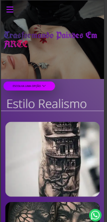
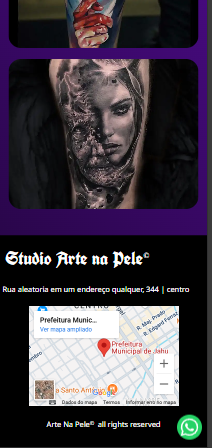

# Portifólio de um Tatuador Especializado em realismo
## 🎯 Objetivo do Projeto
> Este portfólio para tatuador foi desenvolvido com o objetivo de colocar em prática os conhecimentos adquiridos sobre responsividade e manipulação de imagens. A principal meta foi garantir uma experiência visual consistente e fluida em todos os dispositivos, independentemente do tamanho de tela ou velocidade da conexão.
Para isso, foram utilizadas imagens com resoluções otimizadas de acordo com o dispositivo do usuário, além da hospedagem de arquivos de vídeo em servidores externos, evitando impacto negativo na performance e assegurando uma navegação leve e agradável.

## 🛠️ Tecnologias Utilizadas
O projeto foi construído utilizando tecnologias focadas em desempenho, responsividade e boas práticas de desenvolvimento front-end:
HTML5 – Estruturação semântica e acessível do conteúdo.

- CSS3 – Estilização avançada com foco em layout responsivo.

- CSS Grid e Flexbox – Criação de layouts adaptáveis para diferentes tamanhos de tela.

- Media Queries – Ajustes de layout para diferentes dispositivos.

- Tag <picture> – Carregamento inteligente de imagens com diferentes resoluções.

- Tag <video> – Inserção de vídeos como elemento visual complementar.
  
## Imagens do Projeto 🤳
 Hospedagem de mídia externa – Para garantir carregamento rápido e performance otimizada:
  ### Desktop 💻

  ### Mobile 📱
  

  

 

  

 

  

